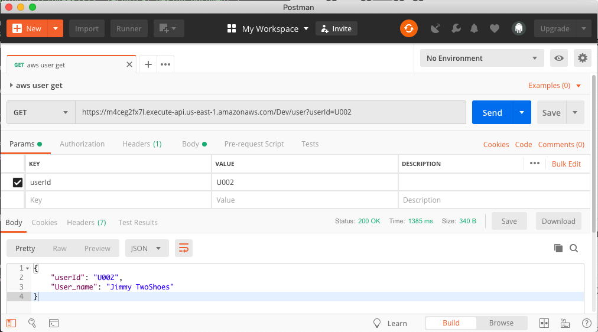

### Week one of labs is off to a quick start. This week as a team we accomplished:

- Creating our Technical Design Document
- Basic Frontend Deployed
- Basic Backend Deployed

## Technical Design Document

[Link to our Technical Design Document](https://docs.google.com/document/d/1rgiptfWw7VxBhV8BANO4Xj8aRgt0gUwRnjgb33ONuVo/edit#heading=h.tclp499k2x73 "Technical Design Document")

This was our first real dive into the project, outlining our idea and exactly what tools we planned to use. I introduced the team to [WeTransfer](https://wetransfer.com/ "WeTransfer") which appeared to be the main player in the space and very similar to what we would like our project to look like.

For our Frontend we decided to use React.js, being component based it would make creating pages for large amounts of users an easy process. For our backend we chose Node.js, which is very popular to handling REST APIs. Most importantly Node.js has an AWS SDK which we will be relying on heavily.

The biggest decision we made was to use AWS S3 for file storage. After researching competing services I urged the team to use AWS. Amazon Simple Storage Service (S3) is affordable, scalable, and frankly a perfect match for what we are trying to accomplish with this project. Using the AWS SDK we will be able to have our backend communicate with S3 and seamlessly transfer files between them.  

## Frontend

[Project Frontend](https://github.com/Lambda-School-Labs/labs10-big-files/tree/master/Frontend/share_big_files)
My teammates Tom and Anthony created a basic frontend to deploy for this week.

## Backend

This is where my major contributions were this week. Using AWS's DynamoDB, Lambda, and API Gateway I was able to create a serverless Database and full REST API. 

- DynamoDB is a full serverless NoSQL database, used by companies like Lyft and Airbnb
- AWS Lambda lets you run code without provisioning or managing servers, essentially letting you run functions in the cloud.
- Amazon API Gateway is a fully functioning REST API at scale, as well as its ability to easily trigger code running on AWS Lambda.

When an App makes a request to our endpoint the API Gateway takes it and turns to Lambda, which runs a function to either add or return the requested information from DynamoDB. 

Here is a code excerpt we used to add a user to our database:

    from __future__ import print_function # Python 2/3 compatibility
    import boto3
    import json
    import decimal
    from boto3.dynamodb.conditions import Key, Attr
    from botocore.exceptions import ClientError

    # Helper class to convert a DynamoDB item to JSON.
    class DecimalEncoder(json.JSONEncoder):
        def default(self, o):
            if isinstance(o, decimal.Decimal):
                if o % 1 > 0:
                    return float(o)
                else:
                    return int(o)
            return super(DecimalEncoder, self).default(o)

    dynamodb = boto3.resource("dynamodb")

    table = dynamodb.Table('big_files_users')

    def lambda_handler(event, context):
        response = table.update_item(
            Key=event,
            UpdateExpression="set userId= :r, User_name=:p",
            expressionAtrributeValues={
                ':r':event['userId'],
                ':p':event['User_name']
            },
            ReturnValues="UPDATED_NEW"
        )
    print("UpdateItem succeeded:")
    print(json.dumps(response, indent=4, cls=DecimalEncoder))
