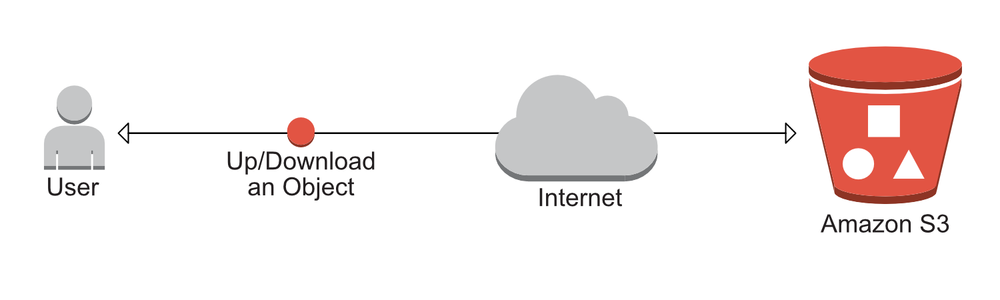
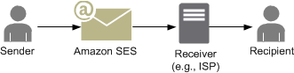

### Week Two Accomplishments:

- AWS S3 Integration
- AWS SES Setup

## AWS S3

[Link to our S3 Routes](https://github.com/Lambda-School-Labs/labs10-big-files/blob/master/lambdafiles/routes/api/s3.js "S3 Routes")
[S3 PR1](https://github.com/Lambda-School-Labs/labs10-big-files/pull/39)
[S3 PR2](https://github.com/Lambda-School-Labs/labs10-big-files/pull/40)
[S3 PR3](https://github.com/Lambda-School-Labs/labs10-big-files/pull/45)

The biggest challenge this week was implementing S3 to upload and download files. S3 makes this process relatively simple, but as a file hosting site - this is a major piece of our project. We used a combination of the [AWS-SDK](https://aws.amazon.com/sdk-for-node-js/), [Multer](https://www.npmjs.com/package/multer), and [MulterS3](https://www.npmjs.com/package/multer-s3) to accomplish this. The AWS-SDK allows us to use node to communicate with our S3 buckets easily. Multer is a popular package for uploading files, and MulterS3 is specifically designed to upload files to S3.

This is our code for uploading files into S3:

    const fileUpload = multer({
      storage: multerS3({
        s3: s3,
        bucket: "s3lambdafiles123",
        // acl: "public-read",
        key: function(req, file, cb) {
          cb(
            null,
            path.basename(file.originalname, path.extname(file.originalname)) +
              "-" +
              Date.now() +
              path.extname(file.originalname)
          );
        }
      }),

      limits: { fileSize: 2000000 } // In bytes: 2000000 bytes = 2 MB
    }).single("fileUpload");

## AWS SES

[link to our AWS SES Routes](https://github.com/Lambda-School-Labs/labs10-big-files/blob/master/lambdafiles/routes/api/ses.js)
[SES PR](https://github.com/Lambda-School-Labs/labs10-big-files/pull/51)

AWS SES is a cloud-based email sending service, which we planned to use to allow users to send out links to their uploaded files. We got this service working but unfortunently Amazon denied us the ability to send out emails to unverified users. This means that any user wanting to download a file would first have to receive a confirmation email, and only then receive the URL. Two emails and a verification process to receive a URL is certainly not a clean user experience. So despite this working technically we will likely switch over to a non-amazon service such as [SendGrid](https://sendgrid.com/).

The following is an example of using AWS-SDK to interact with SES.

    app.get("/", (req, res) => {
      var to = ["yourverifiedemail@email.com"];
      var from = "yourverifiedemail@email.com";
      ses.sendEmail(
        {
          Source: from,
          Destination: { ToAddresses: to },
          Message: {
            Subject: {
              Data: "Email from Amazon SES"
            },
            Body: {
              Html: {
                Charset: "UTF-8",
                Data: "Hey, It's a Email from amazon SES(Simple Email Service)"
              }
            }
          }
        },
        function(err, data) {
          if (err) throw err;
          console.log("Email sent:");
          console.log(data);
          return false;
        }
      );
    });
