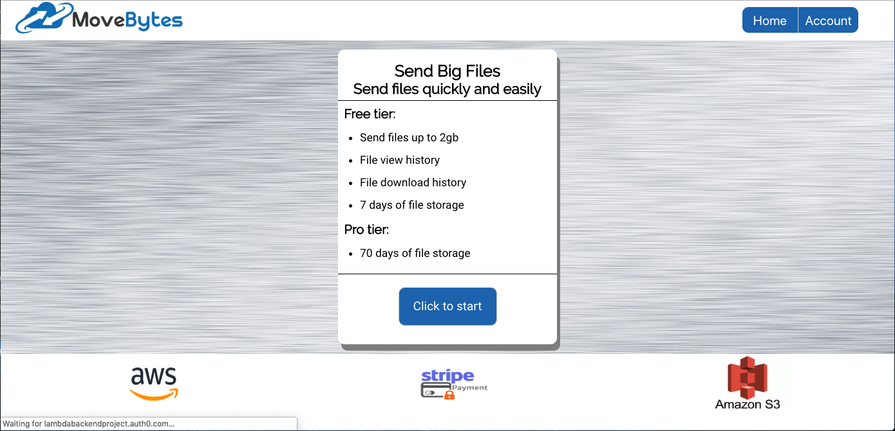
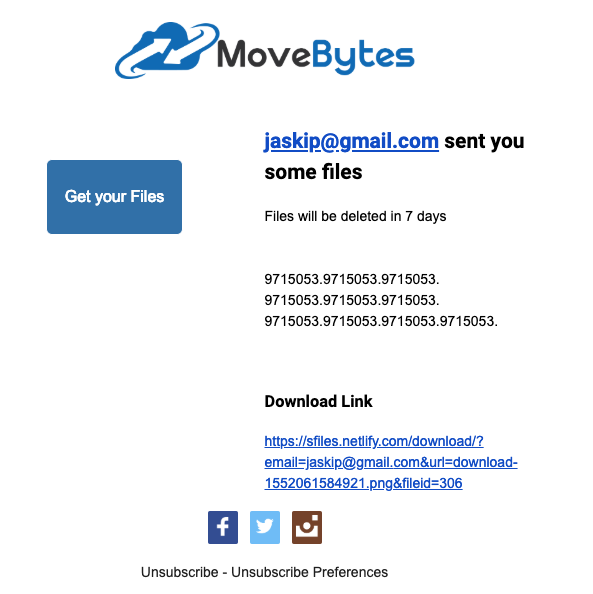
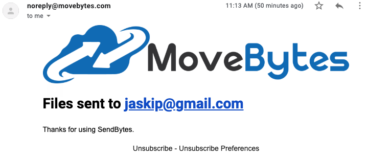

### Week Four Accomplishments:

- UI/UX Changes
- SendGrid

## UI/UX Changes

[Link to our FrontEnd](https://github.com/Lambda-School-Labs/labs10-big-files/tree/master/Frontend/share_big_files "Frontend")

[FE PR1](https://github.com/Lambda-School-Labs/labs10-big-files/pull/190)

[FE PR2](https://github.com/Lambda-School-Labs/labs10-big-files/pull/183)

[FE PR3](https://github.com/Lambda-School-Labs/labs10-big-files/pull/177)

Our Frontend has undergone massive changes over the past week. While this is still a work in progress, it is starting to look much better.

## SendGrid

[Link to our SendGrid Routes](https://github.com/Lambda-School-Labs/labs10-big-files/blob/master/lambdafiles/routes/api/sendgrid.js)

[Sendgrid PR](https://github.com/Lambda-School-Labs/labs10-big-files/pull/173)
[Sendgrid PR2](https://github.com/Lambda-School-Labs/labs10-big-files/pull/168)
[Sendgrid PR3](https://github.com/Lambda-School-Labs/labs10-big-files/pull/167)

This week we completely reformatted our [SendGrid](https://sendgrid.com/) emails. Going for a more professional look, I think the emails turned out well. We also hooked up a custom domain to sendgrid so we can had sender authentication. Sender authentication is a best practice among email senders that requires you to access your DNS host to authenticate your account within your third-party email delivery service.

Sharing files to friends:

Confirmation Email:

The following is an example of using SendGrid v3 API to send emails.

    const sgMail = require('@sendgrid/mail');
    sgMail.setApiKey(process.env.SENDGRID_API_KEY);

    router.post("/send", (req, res) => {
    const {to, from, subject, text, html} = req.body;
    const msg = {
        to: to,
        from: from,
        subject: subject,
        text: text,
        html: html
    };
    sgMail.send(msg);
    console.log("email sent");
    res.send("Email Sent");
